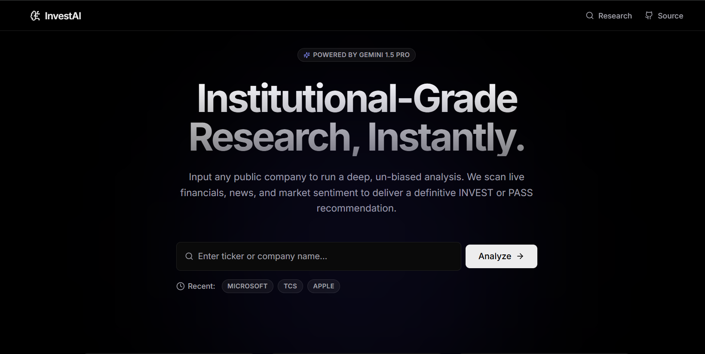

# InvestAI: AI-Powered Investment Research Agent

## Live Demo

Frontend:
https://inside-iim-pi.vercel.app/

Backend:
https://invest-ai-backend.onrender.com

GitHub:
https://github.com/SahilSingh802/insideIIM

## Overview
InvestAI is a full-stack, production-ready AI investment research application. Designed to mimic the workflow of a Wall Street quantitative analyst, the agent takes a public company name, scours the web for live financial data and market sentiment, and delivers a definitive, structured `INVEST` or `PASS` recommendation. 

This project was built to demonstrate proficiency in modern Full-Stack engineering, LangChain agent orchestration, and production-grade system architecture.

---

## Architecture
The application follows a Clean Architecture pattern, decoupling the frontend UI from the AI reasoning engine.

- **Frontend:** React, Vite, Tailwind CSS (Vercel/Linear-inspired minimal dark UI)
- **Backend:** Node.js, Express.js
- **AI / LLM:** Google Gemini 1.5 Flash, LangChain, Tavily Web Search API
- **Validation:** Zod (Strict schema validation for AI JSON generation)
- **Performance & Security:** In-Memory Request Caching, `express-rate-limit`

---

## Installation

### Prerequisites
- Node.js (v18+)
- Google Gemini API Key
- Tavily API Key (Optional, for live web search)

### Setup
1. Clone the repository:
   \`\`\`bash
   git clone https://github.com/your-username/invest-ai.git
   cd invest-ai
   \`\`\`

2. Install dependencies for both client and server:
   \`\`\`bash
   cd client && npm install
   cd ../server && npm install
   \`\`\`

3. Start the development servers:
   \`\`\`bash
   # Terminal 1 (Frontend runs on port 5173)
   cd client && npm run dev
   
   # Terminal 2 (Backend runs on port 5000)
   cd server && npm run dev
   \`\`\`

---

## Environment Variables
Create a `.env` file in the `server` directory:

\`\`\`env
PORT=5000
NODE_ENV=development
GEMINI_API_KEY=your_gemini_key_here
TAVILY_API_KEY=your_tavily_key_here
\`\`\`

Create a `.env` file in the `client` directory (for production only):
\`\`\`env
VITE_API_URL=https://your-production-backend-url.onrender.com
\`\`\`

---

## How it Works

1. **User Input:** The user submits a company ticker or name via the sleek, glassmorphism React UI.
2. **Caching Layer:** The Express backend first checks the local `Map` cache. If the company was recently analyzed, it returns the cached JSON instantly, bypassing the LLM (0s latency, $0 cost).
3. **Agentic Reasoning:** If not cached, the request is passed to the Two-Phase LangChain workflow.
4. **Structured Delivery:** The backend formats the AI's response using Zod schemas and streams it back to the client, where it is mapped to animated React dashboard cards.

---

## AI Workflow (Two-Phase Architecture)

To completely eliminate hallucinations and guarantee perfect JSON syntax, the LangChain agent is split into two phases:

1. **Phase 1: The Researcher (`AgentExecutor`)**
   A ReAct agent tasked *only* with using tools (Tavily search) to gather raw, factual data across predefined pillars (Revenue, Products, Moat, Risks).
2. **Phase 2: The Synthesizer (`withStructuredOutput`)**
   A secondary LLM call (with `temperature: 0` for maximum strictness) that takes the raw notes from Phase 1 and maps them perfectly into a Zod schema. This prompt includes a strict **Anti-Hallucination Protocol** that forces the model to return "Data not available" if it cannot find specific metrics in the researcher's notes.

---

## Example Output
The AI returns a strict JSON object mapping to the frontend:
\`\`\`json
{
  "companyOverview": "Global leader in high-performance computing and AI infrastructure.",
  "industry": "Semiconductors & AI Technology",
  "finalRecommendation": "INVEST",
  "confidenceScore": 88,
  "strengths": ["Strong YoY revenue growth (+24%)", "Unmatched competitive moat"],
  "weaknesses": ["Trading at a premium valuation (P/E 45x)"],
  "risks": ["Impending antitrust regulatory scrutiny in the EU"],
  "growthPotential": ["Upcoming launch of next-gen AI silicon architecture"]
}
\`\`\`

---

## Trade-offs
- **In-Memory Cache vs. Redis:** I used a standard JavaScript `Map()` for caching instead of Redis. While Redis is superior for distributed microservices, a `Map()` was chosen to keep the deployment architecture simple and dependency-free for this assignment.
- **REST vs. SSE (Streaming):** The current implementation waits for the full AI thought process to finish before returning the JSON. Using Server-Sent Events (SSE) would improve perceived latency, but waiting for the full Zod schema ensures 100% data integrity before rendering the UI.

---

## Future Improvements
- **RAG for SEC Filings:** Integrate `pdf-parse` and vector embeddings to allow the agent to read raw 10-K filings directly from the SEC EDGAR database instead of relying on web search.
- **Interactive Financial Charts:** Use `Recharts` to map historical revenue data returned by the LLM into interactive dashboard widgets.
- **Persistent Auth & History:** Replace LocalStorage with PostgreSQL/Prisma to track user search history and portfolio preferences across devices.

---

## Deployment

- **Frontend:** Deployed on **Vercel** for optimal static asset delivery and edge routing.
- **Backend:** Deployed on **Render** (Node.js Web Service) to handle the long-running LangChain processes. 
- **CI/CD:** Connected directly to GitHub main branch for automated deployments.
